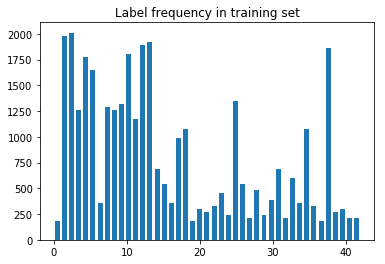

# Build a Traffic Sign Recognition Project

The goals / steps of this project are the following:
* Load the data set (see below for links to the project data set)
* Explore, summarize and visualize the data set
* Design, train and test a model architecture
* Use the model to make predictions on new images
* Analyze the softmax probabilities of the new images
* Summarize the results with a written report

[//]: # (Image References)

## Data Set Summary & Exploration

The dataset given was a slightly augmented version of the *German Traffic Sign Recognition Benchmark (GTSRB)*:
* Number of training examples: 34799
* Number of validation examples: 4410
* Number of testing examples: 12630
* Image data shape: (32, 32, 3)
* Number of classes: 43

One of the challenges of this dataset was that the classes varied greatly in the number of samples:

Another Challenge was the quality of the input.
Quite a few images had either bad exposure, were blurred or both:

## Design and Test a Model Architecture

### Pre-processing

The dataset differed widely in contrast and brightness.
To combat this, I decided to use histogram equalization.
I compared regular equalization and CLAHE, an adaptive method.
I also used both the LAB and YUY colorspace in my tests:

All 4 combinations clearly improve the input.
Between YUV and LAB there is not much difference which is what I expected.
There is no clear winner between CLAHE and simple equalization.
While CLAHE usually results in a better contrast ist also tends to amplify noise.
In the end I decided to go with CLAHE, but I didn't compare the results of both methods after training.

### Augmentation

The amount of samples per class varies greatly.
This usually results in a bias of the trained network.
To combat this, I decided to augment the data such that every class will have 3000 training examples.

For this I used Keras's ImageDataGenerator to generate rotated, shifted and zoomed variations of the samples:

### Architecture

TODO: Describe architecture

### Results

My final model results were:
* training set accuracy of 99.9%
* validation set accuracy of 98.2%
* test set accuracy of 97.1%

## Test a Model on New Images

TODO

## Visualization the Neural Network

TODO

