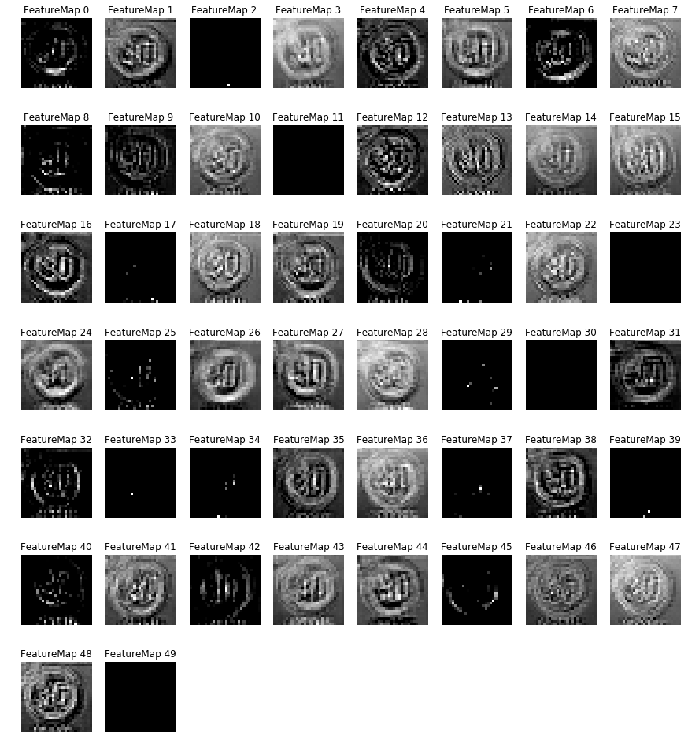

# Build a Traffic Sign Recognition Project

The goals / steps of this project are the following:
* Load the data set (see below for links to the project data set)
* Explore, summarize and visualize the data set
* Design, train and test a model architecture
* Use the model to make predictions on new images
* Analyze the softmax probabilities of the new images
* Summarize the results with a written report

## Data Set Summary & Exploration

The dataset given was a slightly augmented version of the *German Traffic Sign Recognition Benchmark (GTSRB)*:
* Number of training examples: 34799
* Number of validation examples: 4410
* Number of testing examples: 12630
* Image data shape: (32, 32, 3)
* Number of classes: 43

One of the challenges of this dataset was that the classes varied greatly in the number of samples:

Another Challenge was the quality of the input.
Quite a few images had either bad exposure, were blurred or both:

## Design and Test a Model Architecture

### Pre-processing

The dataset differed widely in contrast and brightness.
To combat this, I decided to use histogram equalization.
I compared regular equalization and CLAHE, an adaptive method.
I also used both the LAB and YUY colorspace in my tests:

All 4 combinations clearly improve the input.
Between YUV and LAB there is not much difference which is what I expected.
There is no clear winner between CLAHE and simple equalization.
While CLAHE usually results in a better contrast ist also tends to amplify noise.
In the end I decided to go with CLAHE, but I didn't compare the results of both methods after training.

### Augmentation

The amount of samples per class varies greatly.
This usually results in a bias of the trained network.
To combat this, I decided to augment the data such that every class will have 3000 training examples.

For this I used Keras's ImageDataGenerator to generate rotated, shifted and zoomed variations of the samples:

### Architecture

When deciding on an architecture, I looked at 2 different networks:

1. LeNet. With this I wasn't able to get above 96% Accuracy.
I managed to get a slightly better result by introducing an extra fully connected layer, but didn't use this for the final version.
2. The model described in [Traffic Sign Recognition with Multi-Scale Convolutional Networks](http://yann.lecun.com/exdb/publis/pdf/sermanet-ijcnn-11.pdf).
This model is interesting as it feeds results from the first convolutional layer directly into the fully connected layers.
I wasn't able to replicate the results of the paper though.

For my network I introduced another fully connected layer to the model described in the paper.
I also reduced the number of output-channels of layer1 to 50:

| name   | type            | output shape  | connected to |
|--------|-----------------|---------------|--------------|
| conv1  | convolutional   | (28, 28, 50)  | input        |
| pool1  | pooling         | (14, 14, 50)  | conv1        |
| conv2  | convolutional   | (10, 10, 100) | pool1        |
| pool2  | pooling         | (5, 5, 100)   | conv2        |
| fully1 | fully connected | 200           | conv1, conv2 |
| fully2 | fully connected | 100           | fully1       |
| output | fully connected | 43            | fully2       |

### Results

My final results were:
* training set accuracy of 99.9%
* validation set accuracy of 98.2%
* test set accuracy of 97.1%

This is quite some distance away from the result claimed in the paper, which is 99,17%.
I think this largely because I didn't spend more time optimising my preprocessing and augmentation code.
I did try to use dropout layers, but this only made my result worse, so I opted not to use it.
Looking at the training set accuracy however, it is clear that I am overfitting the data.
I could have also tried L1 and L2 regularization.

Let's look at the confusion matrix to see which errors occured most frequently:

There are essentially 2 confusions:
1. Dangerous curve to the right -> Slippery Road
2. Roundabout mandatory -> End of no passing by vehicles over 3.5 metric tons

The first one is actually about 2 fairly similar looking signs, so this may be expected without better training data.
The second however is mor puzzling. I would have to look at the exact images that produced this error.

## Test a Model on New Images

These are the novel images I used for testing:

I managed to get an accuracy of 81.8%.
The network was able to read almost all correctly, but got stumbled by the 30-zone sign.
While this wasn't technically one of the signs in the set, I would have assumed it would generalize enough.

Looking at the actual network output, one can clearly see that the network is confused as to what speed sign it is, but the correct class is still in the top3:

## Visualization the Neural Network

I decided to look at the first convolutional layer to find out why the network doesn't recognize the 30 sign correctly.

You can clearly see that edges were detected, but the number 30 is hardly legible in any of them.
Additionally about half of the outputs is completely blank.
Maybe reducing the number of outputs would be an option.

Let's look at the other 30 sign that worked correctly:

Here the lines are much more defined and none of the outputs is empty.
You can see different aspects of the outline in each of them, giving the rest of the network a base to work on.
